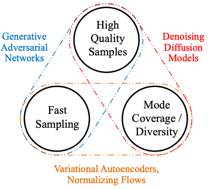

## Diffusion models ([DDPM](https://arxiv.org/abs/2006.11239), [DDIM](https://arxiv.org/abs/2010.02502)) &mdash; TensorFlow Implementation

<div align="center">
  
</div>

## Usage
### Train DDPM
```
> python main.py --objective ddpm
```

### Train DDIM
```
> python main.py --objective ddim
```

## Summary note
* [summary_note](https://taki0112.notion.site/Diffusion-865bb58b677547b7ad4eb383ef6e927e)

## Author
* [Junho Kim](http://bit.ly/jhkim_resume)
